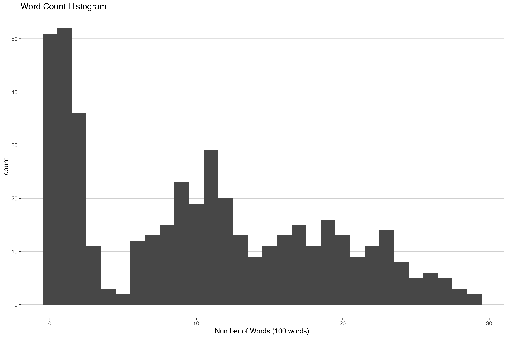
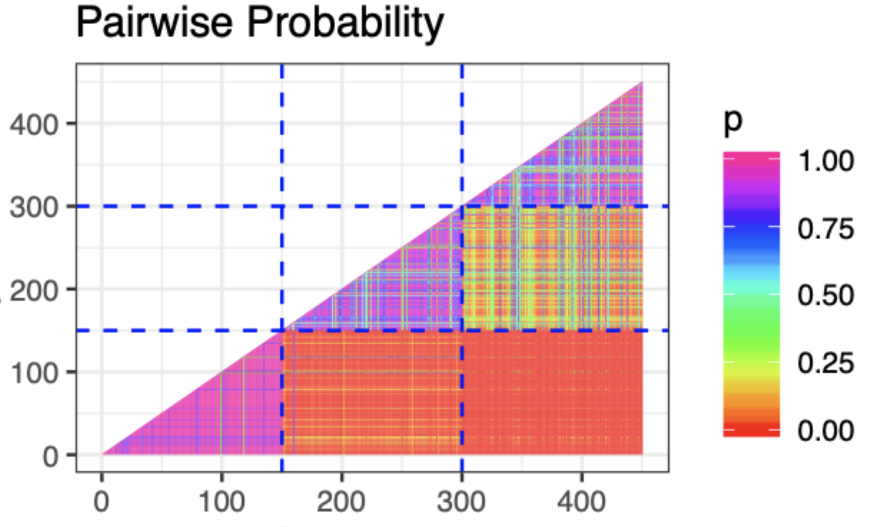
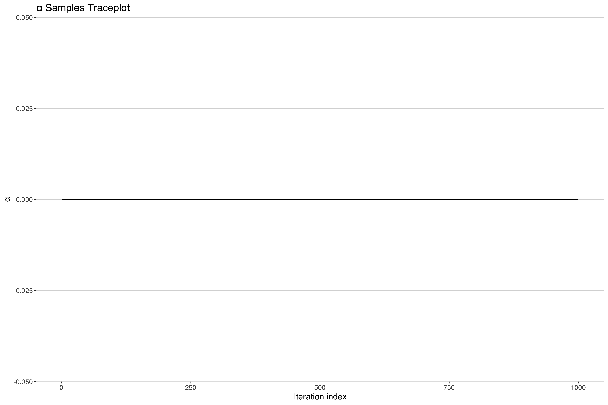
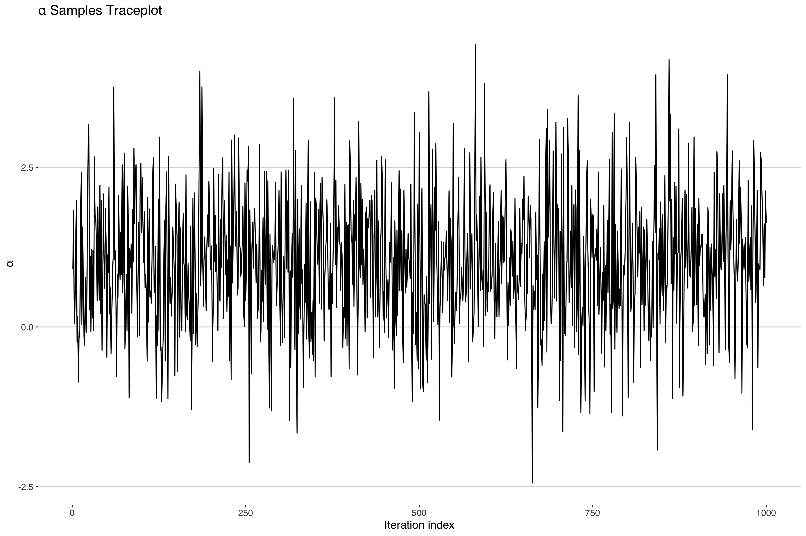

In the course of conducting statistical research, there are times when you can come across some computational-statistical behavior that can only be described as *weird*.
While working on some of my dissertation research to develop a new application for an extension of the Dirichlet Process,
I came across one of these oddities.  Since this is a subject on which I (and hopefully others) could benefit from more perspective, I thought I'd
write up a quick blog post or three detailing the path my research took, the weird behavior I observed along the way and the paper trail I worked through
to try to reach some level of resolution in the matter. While I'd like to make this as accessible as possible to any interested readers,
I'm not going to be able to get away from the fact that this stuff is pretty heavy on the math. My hope is that a master's level (Bio)Statistics student
who had recently completed their theory courses could, with some effort, understand everything that is going on here. I've also written a 
shorter, condensed version of this same series for those have a working familiarty with the Dirichlet Process available which will be posted soon.

Since the peculiarity in question arises in the context of working with the Dirichlet Process, I'll begin with some brief background on the subject.

## A Quick Dip into the Dirichlet Process

The [Dirichlet Process](https://en.wikipedia.org/wiki/Dirichlet_process)(DP) is a distribution over probability measures. That is, similar
to how a binomial distribution is defined by assigning probabilities to two discrete numbers, typically 0 and 1, the DP is defined 
by assigning probabilities to **other** probabilities associated with numbers. So while "observations" or "random draws" from most distributions
are numbers, a random draw from a dirichlet process is a distribution itself.  It's a little bit meta, but very useful in certain settings.

The aforementioned numbers that the DP draws are defined on, come from the "base measure", $G_0$, one of the two parameters that define the DP. The other parameter is a positive real
scalar $\alpha >0$. Conceptually, the base measure serves as the mean of the DP, the distribution around which the process is centered, and
$\alpha$ represents how close or "concentrated" the draws from the DP will be from the base measure. That's right, $\alpha$ is the titular concentration parameter, the 
primary source of intrigue in this mystery.

This process was first formally written about in a 1973 [article](https://www.jstor.org/stable/2958008?seq=1#metadata_info_tab_contents) by Thomas Ferguson titled 
"A Bayesian Analysis of Some Nonparametric Problems". In this paper, Ferguson laid out the groundwork for the DP and many of its properties including the 
tie-in to it's name:

> a stochastic process $P$ ... is said to be a Dirichlet process ... with parameter $G_0$ if ... $(P(A_1),...,P(A_k))$ has a Dirichlet distribution with parameter ($G_0(A_1),...,G_0(A_k)))$ [^1]

In the above $A_1,...,A_k$ can just be thought of as numbers. So what the above line says is that the probability of those numbers is distributed according to the [Dirichlet distribution](https://en.wikipedia.org/wiki/Dirichlet_distribution)
whose parameters are determined by the base measure.

There's been lots of development on the DP since the 70's. One particularly important development was first discussed In a 2001 [paper](http://people.ee.duke.edu/~lcarin/Yuting3.3.06.pdf), where Ishwaran and James showed that realizations, $G$, 
of the DP could be represented (and computationally approximated) as an infinite sum over some indicator functions, $\delta_{\theta}(\cdot)$ and weights, $\pi_l \in (0,1)$  

$$
G  = \sum^\infty \pi_l \delta_{\theta}(\cdot)
$$

If you'd like try visualizing this and other manifestations of the dirichlet process you can check out this [interactive app](https://stablemarkets.shinyapps.io/dpmixapp/), which has a lot of great tools for looking at the DP.

After all this theory you may find yourself asking, "Ok... What is this fancy distribution on distributions even good for?". It's a worthwhile question that we'll look at next.

## Cute Clustering Example

Suppose you're interested in sorting some news articles by how how many words are in them.
If you looked at a histogram of the word count you might see something like this.

Some articles don't have that many words, others have a moderate amount of words and others have a lot of words. One way you could cluster this is by
fitting a mixture model with three components:

$$
f(y) = \sum^{3} w_l \text{Poisson}(y|\lambda_l),
$$

where $f(y)$ is the density of the random word count, $y$, $\lambda$ is the mean of the $l$th Poisson cluster and $\sum^{3} w_l = 1, w_l \in (0,1)$.

An important assumption in the above model is that you only need **three** mixture components to estimate the density. This is a pretty big assumption - 
after all, how often do you know the *right* number of clusters to include in your model? 

If we were able to remove this assumption that would greatly improve this kind of modeling approach. Enter the DP.  The DP is able to flexibly add more 
or less clusters as needed to consistently estimate the density $f(y)$ of interest. To adapt our above model with the DP then the above sum get replaced with the following
fancy integral:

$$
f(y) = \int \text{Poisson}(y|\lambda) G(\lambda).
$$
$$
G\sim DP(\alpha,G_0)
$$
In the above we would say that we're using G, a realization from the Dirichlet Process, as a mixing measure to combine different Poisson components to estimate the density $f(y)$.

Everything make sense so far? Good, cause this is where things get weird.

## Computational Complications 

Alright, so let's say we have some simulated data of article word counts like the graph above that we want to cluster: 450 news articles each from 1 of 3 clusters. 
Since we simulated the data, we know how many true clusters there are but we're still going to use our DP model because we want to make sure it is working correctly. 
After all, when we get the real data, we won't know how many true clusters will be present. Best to make sure things work in this simple case. 

How do we go about fitting the model? Well to keep things brief, since the posterior[^2] of a DP is  another DP, we're going to use a blocked Gibbs sampler. If you're 
interested in seeing the full technical write-up you can check this reference[^3] or the simulation results [here](https://drive.google.com/file/d/18EZrw0hak00vXi2W5XUOl0Xz8n5w34x8/view?usp=sharing) (code is available [here](https://github.com/apeterson91/BEFcluster/blob/dad230313386839600fd63868022e79d928d5da7/src/rcppeigen_hello_world.cpp) )
but for now I'll focus on just a few of the results.

The first thing we might look at is a plot of the pairwise probability of co-clustering like the one below.

This is great! We can see that we're captuing the three clusters clearly through the high probability of co-clustering within the three groups. Something must be working correctly!
Let's check some of the other parameters. In fact, let's check that concentration parameter $\alpha$ which describes how closely the DP is centered around the base measure.

Uh-oh. It looks like our concentration parameter has *collapsed* at 0. Normally one would expect a traceplot of an MCMC sampler to look something more like the following.

Indeed, if we look at the other parameter estimates, they look like the above[^4] suggesting convergent model fit. In fact most model diagnostics will suggest nothing is wrong here.
What is going on?

## The Cliffhanger
So why the discrepancy? Is it just that I messed up my code somewhere? If not, what consequences does this have for our model inference? After all, we recovered the right clusters!

Well, I'll pursue all these questions and more in The Curious Case of the Collapsing Concentration Parameter: Part II.

[^1]: This is an abridged quote with edited notation to fit with the rest of this post. You can check out the original sentence 3/4 of the way down on the first page of Ferguson's [paper](https://www.jstor.org/stable/2958008?seq=1#metadata_info_tab_contents).
[^2]: That's right, the DP is used as a prior in a bayesian paradigm. If you need an update on bayesian statistics I'd reccomend the textbook in footnote 3[^3]. 
[^3]: (Chapter 23 Gelman et al. (2013). Dirichlet Processes In *Bayesian Data Analysis* (pp.560-587) Chapman and Hall/CRC.
[^4]: There may be some irregularities due to label switching, but these are expected. See Ch. 22 in the textbook[^3].
